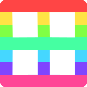

# UDIM Shader Material for Godot

### Blender Model with UDIM Tile Material

### Same Model in Godot with UDIM Shader Material

## Notes:
This addon tries to replicate most of the provided options from the StandardMaterial3D resource.
Much of the options are still being tested and built. If you have need of a particular material feature, please create an issue.

### List of features that appear to be working, the rest are a work in progress
- Albedo Tileset
- Albedo Color
- Transparency Settings
- Shading Settings
- Grow Settings

## Installation Options
1. Download from the Asset Library via the Godot Editor.
2. Manually download this repo, and put the addons/udim_material folder in your project's addons/ directory.

## Usage
1. Create a UDIMShaderMaterial in a 3D material property.
2. Create a UDIMTextureTileset in the "Albedo" > "Albedo Tileset" propererty of the UDIMShaderMaterial
3. Click left click the UDIMTextureTileset to reveal an "Import UDIM Texture Set" button, left click it.
4. Browse to and select one of any of the appropriately named UDIM tile textures from the tileset you'd like to use.
5. Done!
